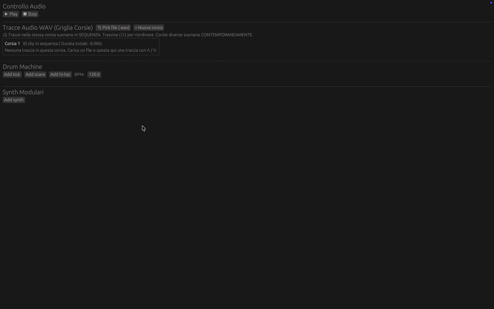

# Rust Mini DAW

A lightweight Digital Audio Workstation built in Rust.

After learning the fundamentals of Rust and reading *The Rust Programming Language* book, I wanted to build a real-world project to put theory into practice. Combining uni studies in sound sampling and quantization with my lifelong struggles to understand traditional DAWs, this project was born. 

While rudimentary, I think it represents a solid starting point.

### What I Learned
* **Rust Concepts:** Thread management, the borrow checker, lifetimes, atomic variables, idiomatic conventions, new code patterns, and interpreting compiler errors.
* **Audio & DSP:** Linear interpolation, sample rates, resampling, custom filters, oscillators, real-time audio threads, and sequencer logic.
* **Tooling:** Navigating crates/libraries, evaluating options online, and reading documentation.

> **Note on AI usage:** AI was used primarily as an interactive teacher to explain complex concepts, as well as for secondary tasks like UI fixes and unblocking me when stuck.

## Features

- **WAV track playback** — load and mix multiple audio files simultaneously
- **Per-track controls** — individual volume, mute, and filter settings
- **Filters** — lowpass, highpass, bandpass, and notch filters with adjustable cutoff frequency
- **Synthesizer tracks** — sine, square, and triangle wave oscillators with a built-in step sequencer
- **Drum machine** — kick, snare, and hi-hat tracks with a 32-step pattern grid and custom sample support
- **BPM control** — global tempo affecting the drum sequencer
- **Playback controls** — play, pause, and stop with a progress bar

### Track Management
*Adding/removing tracks and using core features:*


### Drum Machine Setup
*Configuring the sequencer (requires sample files):*


### Synth & Note Editing
*Video walkthrough on creating and editing synth notes:*



## Built With

- [cpal](https://github.com/RustAudio/cpal) — cross-platform audio I/O
- [hound](https://github.com/ruuda/hound) — WAV file loading
- [fundsp](https://github.com/SamiPerttu/fundsp) — DSP and audio synthesis
- [eframe / egui](https://github.com/emilk/egui) — immediate mode GUI

## Requirements

### Linux
```bash
sudo apt install libasound2-dev pkg-config
```

### macOS & Windows
No additional dependencies required.

## Building

```bash
git clone https://github.com/Obi-Jian/Rust-Mini-DAW.git
cd Rust-Mini-DAW
cargo build --release
```

The binary will be at `target/release/rust-mini-daw`.

## Usage

### WAV Tracks
Click **Pick file** to load one or more `.wav` files. Each file is added as a separate track with its own volume slider and filter controls.

### Drum Machine
Click **Add kick**, **Add snare**, or **Add hi-hat** to create drum tracks. Use **Add sample +** to load your own `.wav` samples for each instrument. Toggle the 32 step buttons to build a pattern.

### Synthesizer
Click **Add synth** to create a synthesizer track. Add notes with **Add note**, then adjust frequency (Hz) and duration for each step. Select the waveform type (sine, square, triangle) from the dropdown.

### Samples
This project does not ship with drum samples. Place your own `.wav` files using the **Add sample +** button in each drum track

## Project Structure

```
src/
  main.rs     — entry point
  audio.rs    — audio engine, stream setup, mixing logic
  ui.rs       — egui interface
```

## License

MIT